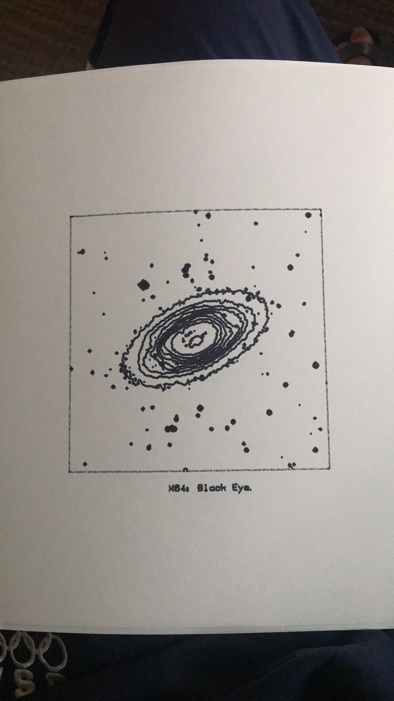

# planetPlotter
An interface library for the HP7470A plotter printer, specifically for plotting from ds9 `.ctr` files and `.svg`. 
Commands are issued to the printer in HP-GL through a GPIB connection. 

## Installation
Requires python < 3.
```pip install -e .```

## Usage
`contours.py` contains functions `svg2command`, `ctr2command` to convert `.svg` and `.ctr` (from DS9) files into a set of HP-GL commands that are saved in `commands.txt`.
Use `python make_command.py` to convert file of choice into `command.txt`.
`python make_plot.py` interfaces with the printer, executing `command.txt`. 

## Printer Usage
* Load bespoke pens **after** turning on the printer.
* Make sure to press `P1` when removing a complete sheet and loading a new sheet, so that the printer coordinate system gets reset for the next set of plot commands.
* Use the silver sharpie for black paper.

## Example
